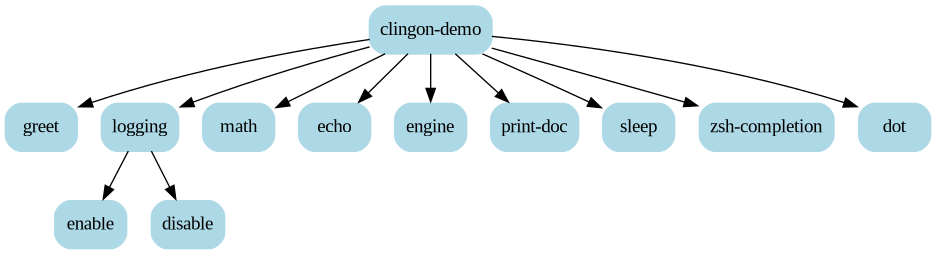

* 2026-04-29

Version =0.7.0= has been tagged.

New features:

- Added support for named positional arguments via =CLINGON:MAKE-ARGUMENT=.
  Named positionals allow defining named positions for free arguments and
  accessing them via =CLINGON:GETOPT=. See [[https://github.com/dnaeon/clingon/issues/19][issue #19]]
- New =copy= sub-command added to the demo application showcasing named
  positional arguments

Bug fixes:

- Fixed =PRINT-USAGE= leaking example code lines to stdout instead of the
  specified stream. See [[https://github.com/dnaeon/clingon/commit/9fb2221][9fb2221]].
- Fixed shared mutable default option instances leaking state between commands
  on repeated parsing. See [[https://github.com/dnaeon/clingon/commit/f88c4e7][f88c4e7]].
- Fixed inherited options accumulating on repeated =INITIALIZE-COMMAND= calls
  during documentation generation. See [[https://github.com/dnaeon/clingon/commit/9f5fb87][9f5fb87]].
- Fixed =OPTION-BOOLEAN= crashing on =FINALIZE-OPTION= when initialized from
  environment variables. See [[https://github.com/dnaeon/clingon/commit/f787ce0][f787ce0]].
- Fixed =OPTION-COUNTER= type error when initialized from environment
  variables. See [[https://github.com/dnaeon/clingon/commit/0391d56][0391d56]].
- Fixed =OPTION-LIST-FILEPATH= environment variable values not being converted
  to pathnames. See [[https://github.com/dnaeon/clingon/commit/66858e3][66858e3]].
- Fixed =--opt== (explicit empty value) being incorrectly treated as a missing
  argument. See [[https://github.com/dnaeon/clingon/commit/f38d425][f38d425]].
- Fixed =PRINT-OPTIONS-USAGE= crash when all options are hidden.
  See [[https://github.com/dnaeon/clingon/commit/46c707a][46c707a]].
- Fixed =JOIN-LIST= stopping early on NIL elements in the middle of a list.
  See [[https://github.com/dnaeon/clingon/commit/f32abe7][f32abe7]].
- Fixed =FINALIZE-OPTION= for list options breaking on double-finalization due
  to destructive =NREVERSE=. See [[https://github.com/dnaeon/clingon/commit/1ad66c2][1ad66c2]].

Performance improvements:

- =FIND-OPTION= now uses O(1) hash table lookups instead of linear scans.
  See [[https://github.com/dnaeon/clingon/commit/0d635b3][0d635b3]].
- =FIND-SUB-COMMAND= now uses O(1) hash table lookups instead of linear scans.
  See [[https://github.com/dnaeon/clingon/commit/30e973a][30e973a]].
- =PRINT-OPTIONS-USAGE= reduced from multiple passes to a single pass over
  options. See [[https://github.com/dnaeon/clingon/commit/73f5423][73f5423]].
- =WALK= utility now uses a hash table for the visited set.
  See [[https://github.com/dnaeon/clingon/commit/ec93e1a][ec93e1a]].

* 2025-07-28

Version =0.6.0= has been tagged.

- Added support for generating documentation in =org= format. See [[https://github.com/dnaeon/clingon/pull/31][PR #31]]
- Added support for generating documentation in =man= format. See [[https://github.com/dnaeon/clingon/pull/23][PR #23]]
- =:filepath= option returns a proper =PATHNAME=. See [[https://github.com/dnaeon/clingon/commit/668b7ce5d0cb1170e3e1d9fe1b576feb792e5c56][this commit]].
- Exit with =EX_OK= (0) instead of =EX_USAGE= (64) when =clingon.help.flag= is
  set.
- Document how to [[https://github.com/dnaeon/clingon?tab=readme-ov-file#customizing-the-parsing-logic][customize the parsing logic]].
- Document how to use [[https://github.com/dnaeon/clingon?tab=readme-ov-file#buildapp][buildapp with clingon]].

Thanks to [[https://github.com/bon][@bon]], [[https://github.com/halcyonseeker][@halcyonseeker]], [[https://github.com/rpgoldman][@rpgoldman]] and [[https://github.com/gpiero][@gpiero]]!

* 2023-05-19

Version =0.5.0= has been tagged.

New conditions added:

- =CLINGON:BASE-ERROR=
- =CLINGON:EXIT-ERROR= (sub-class of =CLINGON:BASE-ERROR=)

New generic functions added:

- =CLINGON:HANDLE-ERROR=

The =CLINGON:BASE-ERROR= condition can be used as the base for new
user-defined conditions, which can be signalled by command handlers.

Whenever a =CLINGON:BASE-ERROR= condition is signalled, the
=CLINGON:RUN= method will invoke =CLINGON:HANDLE-ERROR=, which allows
developers to provide custom logic for reporting and handling of app
specific errors.

Make sure to check the =Custom Errors= section from the documentation
for some examples on how to create user-defined conditions.

The utility function =CLINGON:EXIT= will not exit if the REPL is
connected via SLY or SLIME, which allows for better interactive
testing of the final application.

* 2023-01-24

=clingon= version =0.4.0= has been tagged.

- Added Github Actions to automatically test the =clingon= system.
- Exported =CLINGON:PARSE-INTEGER-OR-LOSE=
- Export symbols to control the default list of options for newly
  created commands. See [[https://github.com/dnaeon/clingon/issues/4][issue #4]]
- =CLINGON:FIND-OPTION= can now search for options by their keys
- =CLINGON:GETOPT= returns three values -- the option value, a boolean
  indicating whether the option was set, and the command which
  provided the option.
- If =--version= is specified for any command, then =clingon= will try
  to find a parent command with an associated version string, if the
  sub-command does not provide it's own version string.
- Added =CLINGON:GETOPT*= which will return the first value from the
  command's lineage, for which the option was defined and set.
- Added =CLINGON:IS-OPT-SET-P*= predicate
- Additional tests related to =CLINGON:GETOPT= and =CLINGON:GETOPT*=
- Added support for /persistent/ options. A /persistent/ option is an
  option which is propagated from parent to all sub-commands. Please
  refer to the documentation for more details and examples.
- =CLINGON:PRINT-DOCUMENTATION= can generate the tree representation
  for commands in [[https://en.wikipedia.org/wiki/DOT_(graph_description_language)][Dot]] format.

This is how the generated tree for the =clingon-demo= app looks like.

* 2022-03-25

Added support for =pre-hook= and =post-hook= actions for commands.

The =CLIGON:COMMAND= class now accepts the =:pre-hook= and
=:post-hook= initargs, which allows specifying a function to be
invoked before and after the respective handler of the command is
executed.

The generic function =CLINGON:APPLY-HOOKS= have been added, which
takes care of applying the =pre-hook= and =post-hook= hooks.

Version of =clingon= system has been bumped to 0.3.5.

* 2022-03-24

Add support for grouping related options into categories.

The =:category= initarg for =CLINGON:OPTION= is used for specifying
the option's category.

New option kind has been added - =:list/filepath=.

The =clingon-demo= and =clingon-intro= binaries are now installed into
the =bin/= directory.

Additional utility functions have been implemented as part of the
=CLINGON.UTILS= package.

=clingon= system updated to version 0.3.3.

* 2021-12-26

=clingon= system updated to version v0.3.1.

Added support for =FILEPATH= option kinds.

* 2021-11-19

Added support for Zsh completions.

=clingon= system version bumped to v0.3.0.

* 2021-07-26

Initial release of =clingon= version v0.1.0.
